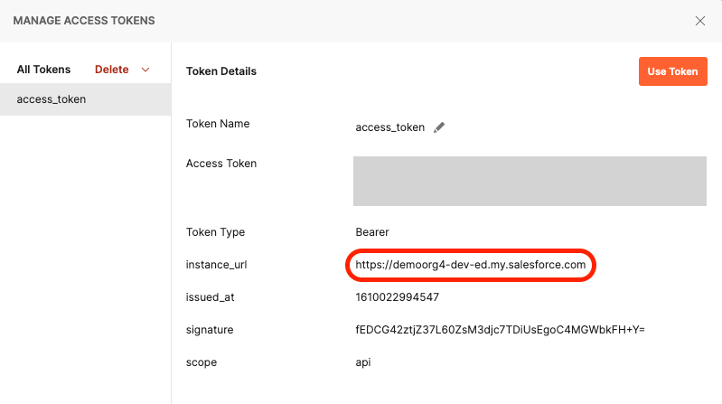
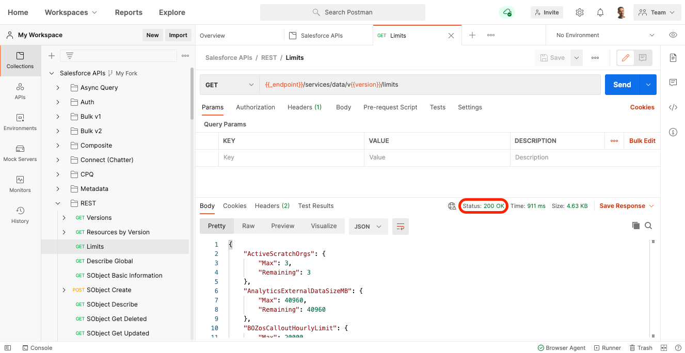

[Back to main page](README.md)

# Installing with the Postman Web UI

Consider this installation option if you can’t install the Postman desktop app.

🎥 [Video instructions](https://youtu.be/lxRNs4LsVdo)

- [Fork the Collection](#fork-the-collection)
- [Configure the Collection](#configure-the-collection)
- [Enable CORS in Salesforce](#enable-cors-in-salesforce)
- [Authenticate with Salesforce](#authenticate-with-salesforce)
- [Execute a Request](#execute-a-request)

## Fork the Collection

1. Using a browser, [sign up/in to Postman](https://identity.getpostman.com/login).
2. Navigate to [this link](https://www.postman.com/salesforce-developers/workspace/salesforce-developers/collection/12721794-67cb9baa-e0da-4986-957e-88d8734647e2/fork) to create a fork of the collection.
3. Enter a label for your fork (e.g.: “My fork”).
4. Select a workspace (the default “My Workspace” workspace is fine).
5. Click **Fork Collection**.

## Configure the Collection

1. Click **Salesforce APIs**
1. Open the **Variables** tab.
1. If needed, update the `CURRENT VALUE` of the `url` variable with your org's My Domain login URL in one of these formats:

    - `https://MyDomainName--SandboxName.sandbox.my.salesforce.com` for sandboxes or Scratch orgs.
    - `https://MyDomainName.my.salesforce.com` for production, Trailhead Playground and Developer Edition orgs.
    - your custom My Domain URL.

1. Click **Save**.

## Enable CORS in Salesforce

1. In Salesforce Setup, enter `CORS` in the Quick Find and select **CORS**.
1. Click **New** under Allowed Origins List
1. Enter `https://*.postman.com` as the **Origin URL Pattern**
1. Click **Save**
1. Repeat the previous steps and add `https://*.postman.co` (note the `.co` domain extension)

## Authenticate with Salesforce

You'll need to authenticate with Salesforce to access the APIs. Doing so grants you an access token that is valid for a certain duration.

Repeat this step whenever your access token expires.

1. Click **Salesforce APIs**
1. Open the **Authorization** tab. The authorization type should be set to OAuth 2.0.
1. Click **Get New Access Token**. This opens a browser tab with the Salesforce login screen.
1. Log in to your Salesforce org.
1. Click **Allow** to grant access to "Salesforce APIs Collection for Postman" to your org.

    

    At this point, if your environment is correctly set up, you should see a success message and you should be redirected to the Postman web UI.

1. Copy the value of the `instance_url` field from the token details view. Make sure not to copy the line break character.

    

1. Click **Use Token**.
1. Open the **Variables** tab.
1. Update the `CURRENT VALUE` of the `_endpoint` variable with the value that you just copied from the `instance_url` field in the access token details.
1. Click **Save**.

## Execute a Request

1. Expand the collection and select the `REST > Limits` request.
1. Click `Send`.

At this point, if your environment is correctly set up, you should see a `200 OK` status. This means that you have successfully authenticated with Salesforce and that you can now use the other collection’s requests.

See [additional documentation](README.md#additional-documentation) for more information on how to keep the collection up to date and work with multiple Salesforce orgs.

[Back to main page](README.md)
